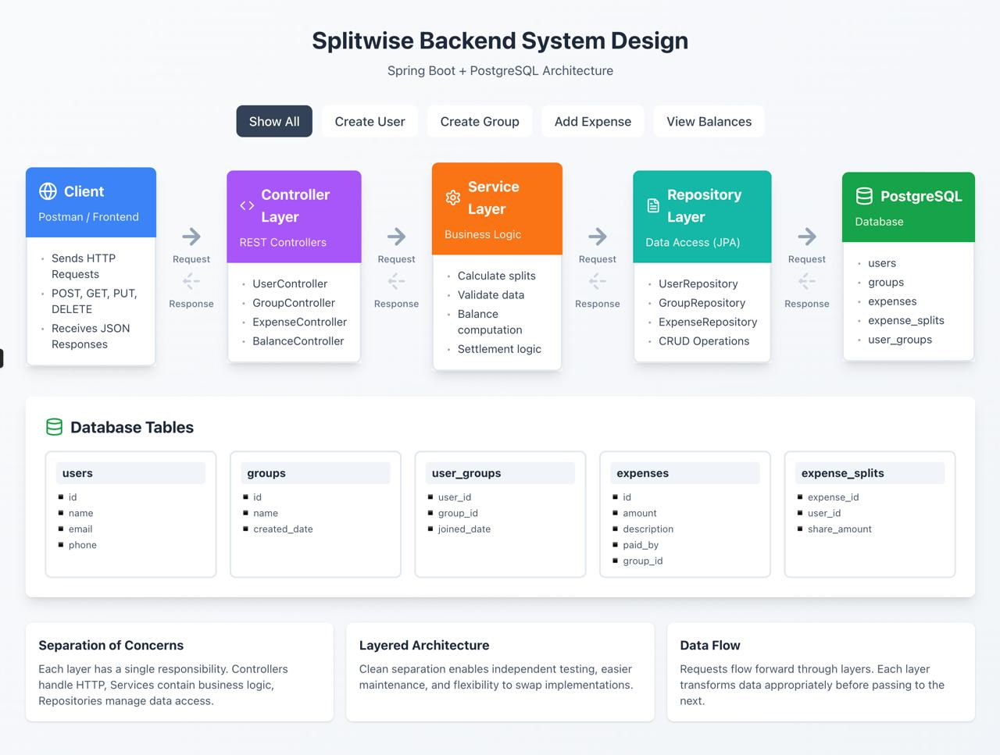
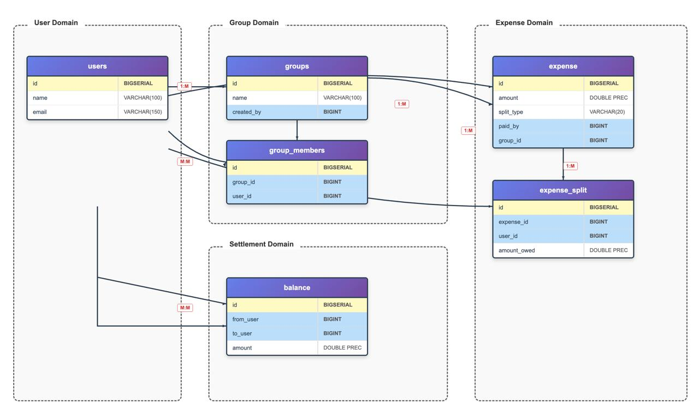

# Expense Sharing Backend (Splitwise-like System)

A **Splitwise-inspired Expense Sharing Backend** built using **Spring Boot** and **PostgreSQL**. This project allows users to create groups, add members, record shared expenses, split expenses among group members, and view simplified balances (who owes whom and how much).

This project follows **clean layered architecture** and is designed to be **beginner-friendly, interview-ready, and production-aligned**.

---

## 🚀 Tech Stack

* **Backend:** Java, Spring Boot
* **Database:** PostgreSQL
* **ORM:** Spring Data JPA (Hibernate)
* **API Testing:** Postman
* **Build Tool:** Maven
* **Architecture:** Monolithic, Layered Architecture

---

## 🏗️ Project Structure

```
expense-sharing
│
├── src/main/java/com/klef/expense_sharing
│   ├── controller        # REST Controllers (API Layer)
│   ├── service           # Business Logic Layer
│   ├── repository        # Data Access Layer (JPA Repositories)
│   ├── entity            # JPA Entities (Database Models)
│   ├── dto               # Request / Response DTOs
│   └── ExpenseSharingApplication.java
│
├── src/main/resources
│   └── application.properties
│
├── pom.xml
├── SystemDesign.jpg      # System Architecture Diagram
├── DataBaseDesign.jpg    # Database ER Diagram
└── README.md
```

---

## 🧩 System Architecture Overview

### 📐 System Architecture Diagram



### Layered Architecture

```
Client (Postman)
   ↓
Controller Layer
   ↓
Service Layer
   ↓
Repository Layer
   ↓
PostgreSQL Database
```

### Layer Responsibilities

#### 1️⃣ Client Layer

* Postman is used to test and verify all APIs
* Sends HTTP requests and receives JSON responses

#### 2️⃣ Controller Layer

Handles HTTP requests and responses.

Controllers:

* `UserController`
* `GroupController`
* `ExpenseController`
* `BalanceController`

#### 3️⃣ Service Layer

Contains core business logic:

* Expense splitting (EQUAL / EXACT / PERCENTAGE)
* Balance calculation
* Data validation

Services:

* `UserService`
* `GroupService`
* `ExpenseService`
* `BalanceService`

#### 4️⃣ Repository Layer

Handles database operations using Spring Data JPA.

Repositories:

* `UserRepository`
* `GroupRepository`
* `GroupMemberRepository`
* `ExpenseRepository`
* `ExpenseSplitRepository`
* `BalanceRepository`

#### 5️⃣ Database Layer

* PostgreSQL database
* Tables designed using relational modeling

---

## 🗄️ Database Design

### 📐 Database ER Diagram



The database schema is designed **exactly according to the implemented JPA entities** in this project.

### Tables (Actual Project Schema)

#### **users**

* `id` (BIGSERIAL, PK)
* `name` (VARCHAR)
* `email` (VARCHAR)

#### **groups**

* `id` (BIGSERIAL, PK)
* `name` (VARCHAR)

#### **group_members**

* `id` (BIGSERIAL, PK)
* `group_id` (FK → groups.id)
* `user_id` (FK → users.id)

> This table represents the **many-to-many relationship** between users and groups.

#### **expenses**

* `id` (BIGSERIAL, PK)
* `amount` (DOUBLE)
* `split_type` (VARCHAR)
* `paid_by` (FK → users.id)
* `group_id` (FK → groups.id)

#### **expense_split**

* `id` (BIGSERIAL, PK)
* `expense_id` (FK → expenses.id)
* `user_id` (FK → users.id)
* `amount_owed` (DOUBLE)

#### **balance**

* `id` (BIGSERIAL, PK)
* `from_user` (FK → users.id)
* `to_user` (FK → users.id)
* `amount` (DOUBLE)

> The **balance table** stores simplified net balances so the system does not need to recalculate balances repeatedly.

---

## 🔄 Data Flow Example (Add Expense)

```
POST /expenses
  ↓
ExpenseController
  ↓
ExpenseService (split calculation + balance update)
  ↓
ExpenseRepository / ExpenseSplitRepository / BalanceRepository
  ↓
PostgreSQL
```

---

## 📡 API Endpoints

### User APIs

* `POST /users` → Create user

### Group APIs

* `POST /groups` → Create group
* `POST /groups/{groupId}/members` → Add member to group

### Expense APIs

* `POST /expenses` → Add expense

### Balance APIs

* `GET /balances/{userId}` → View balances for a user

---

## 🧪 API Testing (Postman)

All APIs are tested using Postman.

### 🔗 Public Postman Collection

```
https://www.postman.com/nayeemshaik-1572/workspace/expense_sharing~692ddc8b-72ca-459c-96a1-5709845aeaaa/collection/29980217-4347eaca-342a-49ba-8065-cf73f4000636
```

Interviewers can directly verify endpoints using this link.

---

## ▶️ How to Run the Project

### Prerequisites

* Java 17+
* Maven
* PostgreSQL

### Steps

1. Clone the repository
2. Create PostgreSQL database:

   ```sql
   CREATE DATABASE expense_sharing;
   ```
3. Update `application.properties` with DB credentials and port:

   ```properties
   server.port=8089
   ```
4. Run the application:

   ```bash
   mvn spring-boot:run
   ```
5. Application starts at:

   ```
   http://localhost:8089
   ```

```sql
   CREATE DATABASE expense_sharing;
```

3. Update `application.properties` with DB credentials
4. Run the application:

   ```bash
   mvn spring-boot:run
   ```
5. Application starts at:

   ```
   http://localhost:8080
   ```

---

## 🎯 Design Principles Used

* Separation of Concerns
* Layered Architecture
* Single Responsibility Principle
* Clean Code Practices

---

## 🧠 Interview Explanation (1 Minute)

> “This is a Splitwise-like expense sharing backend built using Spring Boot and PostgreSQL. It follows a layered architecture where controllers handle HTTP requests, services contain business logic like expense splitting and balance calculation, and repositories interact with the database using JPA. The design ensures clean separation of concerns, maintainability, and easy testing.”

---

## ✅ Project Highlights

* Clean layered architecture
* Proper relational database design
* Simplified balance computation
* Public Postman collection for API verification
* Beginner-friendly yet interview-ready

---

## 📌 Future Enhancements

* Authentication & Authorization (JWT)
* Expense settlement feature
* Pagination & filtering
* Swagger API documentation

---

### 👤 Author

**Nayeem Shaik**
Backend Developer | Java | Spring Boot | PostgreSQL
